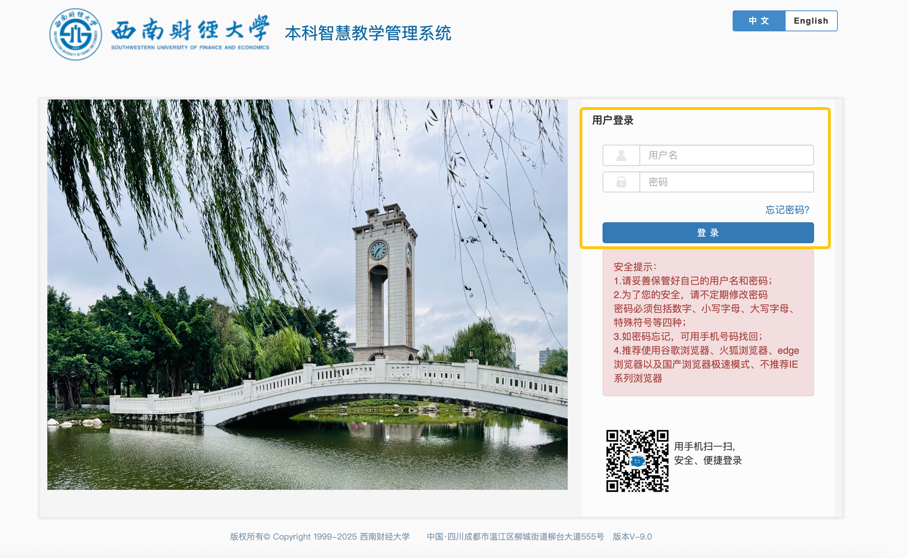
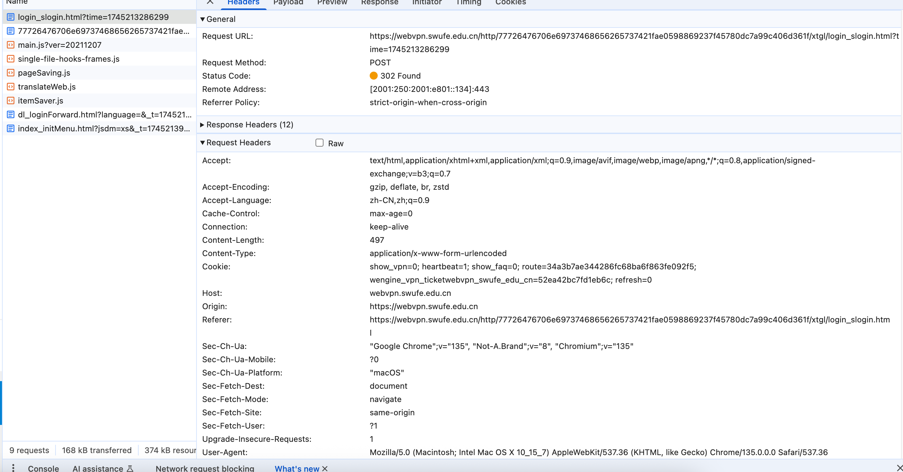
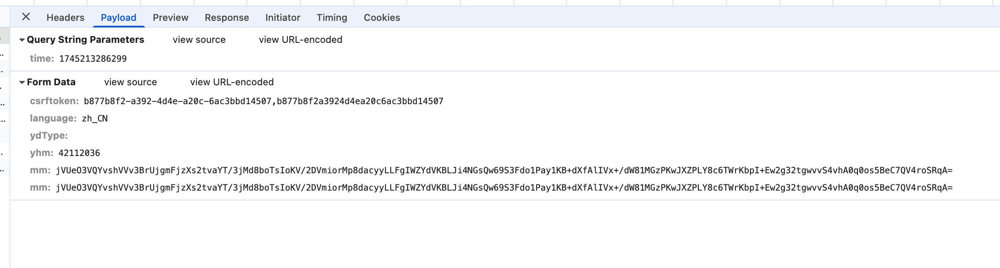
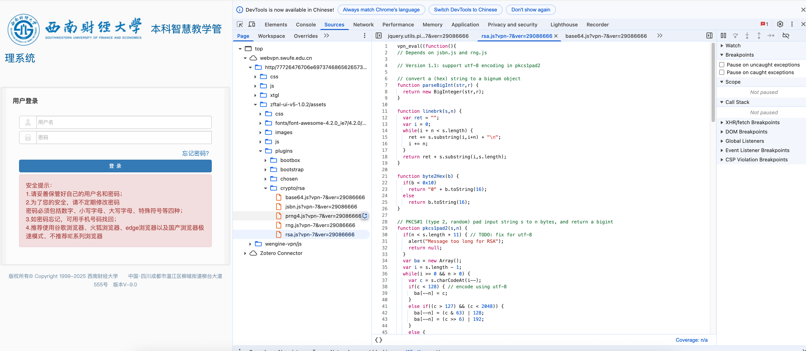
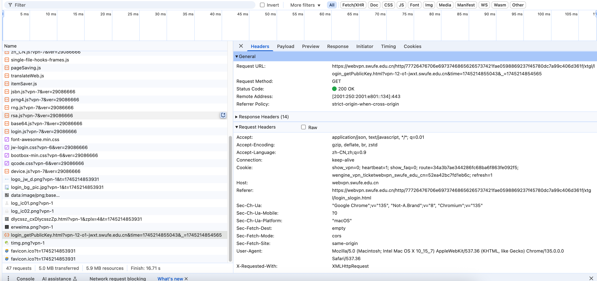
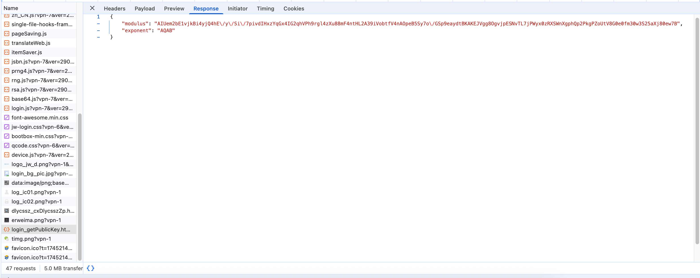

# 登录接口研究
## 登录接口介绍
教务系统首页：http://jwxt.swufe.edu.cn/xtgl/login_slogin.html

直观看到，登录功能需要在首页中，输入【用户名】和【密码】，点击【登录】按钮。即可完成登录。
我们来抓包看一下这一过程。
### 1. 进入首页（GET）


| 字段 | 内容 |
| --- | --- |
| Method | GET |
| Url | https://webvpn.swufe.edu.cn/http/77726476706e69737468656265737421fae0598869237f45780dc7a99c406d361f/xtgl/login_slogin.html|
| Headers | Cookie |
| Response | HTML内容 |

*(注：这是在webvpn环境下抓包的，实际**Cookie**中包含了wenvpn登录态，可能和教务系统本身无关)*
我们最关注的其实是能从Response中获取到的内容，即登录页面的HTML内容。
下面来看一下重点关注的内容。可以看到，这里的登录窗口是用一个form表单实现的，下面复制出来该表单的内容。
```html
<form class="form-horizontal" role="form" action="https://webvpn.swufe.edu.cn/http/77726476706e69737468656265737421fae0598869237f45780dc7a99c406d361f/xtgl/login_slogin.html?time=1745213286299" method="post">
<input type="hidden" id="csrftoken" name="csrftoken" value="b877b8f2-a392-4d4e-a20c-6ac3bbd14507,b877b8f2a3924d4ea20c6ac3bbd14507">
<input type="hidden" id="language" name="language" value="zh_CN">
<input type="hidden" name="ydType" id="ydType" value="">
<div>
    <div class="tab-content">
        <div id="home" class="tab-pane in active">
                <h5>用户登录</h5>
            <!-- 防止浏览器自动填充密码 -->
            <input type="text" style="display: none;" autocomplete="off">
            <input type="password" style="display: none;" autocomplete="off">
            <!-- 防止浏览器自动填充密码 end -->
                <p style="display: none;" id="tips" class="bg_danger sl_danger">
                </p>
            <div class="form-group">
                <div class="input-group">
                    <div class="input-group-addon"></div>
                    <input type="text" class="form-control" name="yhm" id="yhm" value="" placeholder="用户名" onblur="var vpn_return;eval(vpn_rewrite_js((function () {  }).toString().slice(14, -2), 2));return vpn_return;" autocomplete="off">
                </div>
            </div>
            <div class="form-group">
                <div class="input-group">
                    <div class="input-group-addon"></div>
                    <input type="password" name="mm" id="hidMm" style="display:none" autocomplete="off">
                    <input type="text" class="form-control" name="mm" id="mm" value="" placeholder="密码" autocomplete="off" onfocus="var vpn_return;eval(vpn_rewrite_js((function () { this.type='password' }).toString().slice(14, -2), 2));return vpn_return;">
                    <input type="password" style="display:none;" autocomplete="off">
                </div>
            </div>
                <div class="form-group" id="myDiv">
                <!--<a href="/xtgl/init_fkIndex.html" class="checkbox pull-left" target="_blank">访客登录</a> -->
                    <a href="/http/77726476706e69737468656265737421fae0598869237f45780dc7a99c406d361f/pwdmgr/retake/index.zf" id="wjmm" class="checkbox pull-right " target="_blank">忘记密码？</a> 
            </div>	                       
            <div class="form-group">
                <button type="button" class="btn btn-primary btn-block" id="dl">登 录</button>
            </div>
            <!-- 登录口提示信息 -->
                <div class="form-group">
                    <div class="alert alert-danger" role="alert" id="dlktsxx">安全提示：<br> 1.请妥善保管好自己的用户名和密码；<br> 2.为了您的安全，请不定期修改密码<br>密码必须包括数字、小写字母、大写字母、特殊符号等四种；<br> 3.如密码忘记，可用手机号码找回；<br> 4.推荐使用谷歌浏览器、火狐浏览器、edge浏览器以及国产浏览器极速模式、不推荐IE系列浏览器<br></div>
                </div>
                <div class="sl_log_ewm hidden-xs">&nbsp;&nbsp;<span>用手机扫一扫,<br>安全、便捷登录</span></div>
        </div>
        <div id="profile" class="tab-pane" align="center">
                
                
                <p class="tipsqrcode">微信扫码</p>
                <p class="tipsqrcode">扫码关注公众号进行登录</p>
        </div>
        <div class="qcode" id="qcodepc" style="display:none;">
            <p>统一身份认证</p>
            <div id="qrcode1">
                <div id="qrcode-img" title=""><canvas width="179" height="179" style="display: none;"></canvas>
                
                </div>
            </div>
            <div id="qrcode-content" style="display:none;">
                <div class="qrcode-bg"></div>
                <p class="refresh-text">
                    <i class="fa fa-refresh"></i>
                    <a href="javascript:this.top.vpn_inject_scripts_window(this);vpn_eval((function () { void(0); }).toString().slice(14, -2))" id="qrcode_refresh">刷新 </a>
                </p>
            </div>
            <span>打开教务app<br>在【首页】页面上打开扫一扫</span>
        </div>
    </div>
</div>
</form>
```

### 2. 登录（POST）
登录接口比较强的依赖于上述的html表单的内容。我们来尝试抓一下包。在表单中正常填写账号密码后，点击【登录】按钮。接口如下。


| 字段 | 内容 |
| --- | --- |
| Method | POST |
| Url |https://webvpn.swufe.edu.cn/http/77726476706e69737468656265737421fae0598869237f45780dc7a99c406d361f/xtgl/login_slogin.html?time=1745213286299｜
|Request Body|表单内容|
|Response code|302重定向|

由于是POST请求，所以重点来看请求体的内容。
经过分析，可以看到有以下几个字段。

查询参数:**time** ： 毫秒级时间戳
请求体参数：
| 字段 | 内容 |
| --- | --- |
| csrftoken | Token |
| language | 语言 |
| ydType | None |
| yhm |  学号 |
| mm |  密文密码 |
| mm |  密文密码 |

我们从Form表单中来寻找怎么构造这些参数。
从上述html中可以提取出来这些字段，如下
```html
<input type="hidden" id="csrftoken" name="csrftoken" value="b877b8f2-a392-4d4e-a20c-6ac3bbd14507,b877b8f2a3924d4ea20c6ac3bbd14507">
<input type="hidden" id="language" name="language" value="zh_CN">
<input type="hidden" name="ydType" id="ydType" value="">
<input type="text" class="form-control" name="yhm" id="yhm" value="" placeholder="用户名" onblur="var vpn_return;eval(vpn_rewrite_js((function () {  }).toString().slice(14, -2), 2));return vpn_return;" autocomplete="off">
<input type="password" name="mm" id="hidMm" style="display:none" autocomplete="off">
<input type="text" class="form-control" name="mm" id="mm" value="" placeholder="密码" autocomplete="off" onfocus="var vpn_return;eval(vpn_rewrite_js((function () { this.type='password' }).toString().slice(14, -2), 2));return vpn_return;">
```
可以看到，**csrftoken**和**language**是两个固定值，可以直接从首页的response中解析出来这两个字段，填充上去。
**ydType**是一个空字符串。
**yhm**和**mm**是我们需要填写的内容。
**yhm**是学号，**mm**是密码。
但是观察到实际到请求体，**mm**是经过加密后的密文。我们如果想构造请求体，就需要知道这个加密的过程。
目前除了这个加密的密文过程，其他的字段都是可以构造出来的。

接下来就是寻找这个加密算法。
继续抓包寻找关键词，找到了加密算法对应的js文件如下。

我们从源头js来分析。首先找到了login.js文件。
```js
if($("#mmsfjm").val() == '0'){
    $("#hidMm").val($("#mm").val());
}else{
    var rsaKey = new RSAKey();
    rsaKey.setPublic(b64tohex(modulus), b64tohex(exponent));
    var enPassword = hex2b64(rsaKey.encrypt($("#mm").val()));
    $("#mm").val(enPassword);
    $("#hidMm").val(enPassword);   //页面上放了一个隐藏的password类型输入框，name也是mm，防止密码自动填充，在提交的时候把内容设置成跟输入的密码一致
}
```
有这样一段代码，是在提交网络请求的时候，之前写的。
这里可以看到else的逻辑，是对密码进行了加密。
首先通过 new RSAKey() 生成了一个 RSAKey 对象，然后调用 setPublic 方法设置了公钥，其中有两个变量需要获取，一是modulus，二是exponent。
然后调用 rsaKey.encrypt 方法对密码进行加密，最后将加密后的密码设置到输入框中。
所以我们需要找到 b64tohex 和 hex2b64 这两个函数的实现。

```js
// convert a base64 string to hex
/** 函数流程解释
这个函数通过读取 Base64 编码字符串中的每个字符，把它逐步解码为原始的二进制，再把这些二进制转换成对应的十六进制字符。
具体流程如下：
遍历 Base64 字符串中的每个字符。
通过 b64map.indexOf 找到字符对应的值（0~63）。
利用状态变量 k 和 slop 来控制读取的 bit 数。
每读取到足够的 bit，就通过 int2char() 转成对应的 hex 字符。**/
function b64tohex(s) {
  var ret = ""
  var i;
  var k = 0; // b64 state, 0-3
  var slop;
  for(i = 0; i < s.length; ++i) {
    if(s.charAt(i) == b64pad) break;
    v = b64map.indexOf(s.charAt(i));
    if(v < 0) continue;
    if(k == 0) {
      ret += int2char(v >> 2);
      slop = v & 3;
      k = 1;
    }
    else if(k == 1) {
      ret += int2char((slop << 2) | (v >> 4));
      slop = v & 0xf;
      k = 2;
    }
    else if(k == 2) {
      ret += int2char(slop);
      ret += int2char(v >> 2);
      slop = v & 3;
      k = 3;
    }
    else {
      ret += int2char((slop << 2) | (v >> 4));
      ret += int2char(v & 0xf);
      k = 0;
    }
  }
  if(k == 1)
    ret += int2char(slop << 2);
  return ret;
}
```

```js
// convert a hex string to base64
/** 函数流程解释
这个函数通过读取十六进制字符串中的每个字符，把它逐步解码为原始的二进制，再把这些二进制转换成对应的 Base64 字符。
具体流程如下：
遍历十六进制字符串中的每个字符。
通过 hex2int() 找到字符对应的值（0~255）。
利用状态变量 k 和 slop 来控制读取的 bit 数。
每读取到足够的 bit，就通过 int2b64() 转成对应的 Base64 字符。**/
function hex2b64(h) {
  var i;
  var c;
  var ret = "";
  for(i = 0; i+3 <= h.length; i+=3) {
    c = parseInt(h.substring(i,i+3),16);
    ret += b64map.charAt(c >> 6) + b64map.charAt(c & 63);
  }
  if(i+1 == h.length) {
    c = parseInt(h.substring(i,i+1),16);
    ret += b64map.charAt(c << 2);
  }
  else if(i+2 == h.length) {
    c = parseInt(h.substring(i,i+2),16);
    ret += b64map.charAt(c >> 2) + b64map.charAt((c & 3) << 4);
  }
  while((ret.length & 3) > 0) ret += b64pad;
  return ret;
}
```
以上两个函数是Base64和十六进制之间的转换函数。
可以看到加密过程使用了RSA的算法。
我们继续从网络请求中，发现公钥是可以直接获取到的。

来看请求体，如下，公钥的两个部分modulus和exponent可以直接从服务器获取到。

也就是我们实现了这一句设置公钥的表达式。
```js
rsaKey.setPublic(b64tohex(modulus), b64tohex(exponent));
```
```js
// Set the public key fields N and e from hex strings
/** 函数流程解释
 这个函数 RSASetPublic(N, E) 是在 设置 RSA 公钥中的两个关键字段：模数 N 和指数 e。
它通常出现在前端加密库（比如 jsrsasign 或 rsa.js）中，用来配置一个 RSA 公钥，使得后续可以进行加密、验签等操作。
 RSA 公钥由什么组成？
一个 RSA 公钥通常包含两个部分：
n：模数（Modulus），一个大整数，一般是几百位或几千位的十六进制字符串。
e：公钥指数（Exponent），一个较小的整数，常见值是 65537（即十六进制的 010001）。
参数：
N: 表示 RSA 的模数，是一个十六进制字符串。
E: 表示 RSA 的公钥指数，同样是十六进制字符串。
行为：
检查 N 和 E 是否都存在且非空。
parseBigInt(N, 16)：将十六进制的 N 转换为大整数对象，赋值给 this.n。
parseInt(E, 16)：将十六进制的 E 转成十进制整数，赋值给 this.e。
如果检查不通过，就弹出警告框 "Invalid RSA public key"。
 **/

function RSASetPublic(N,E) {
  if(N != null && E != null && N.length > 0 && E.length > 0) {
    this.n = parseBigInt(N,16);
    this.e = parseInt(E,16);
  }
  else
    alert("Invalid RSA public key");
}
```
继续往下走，便是涉及到加密算法的核心内容了。
```js
var enPassword = hex2b64(rsaKey.encrypt($("#mm").val()));
```
这里重点来看encrypt方法的实现。
从rsa.js中，我们找到了这句代码。
```js
RSAKey.prototype.doPublic = RSADoPublic;
RSAKey.prototype.setPublic = RSASetPublic;
RSAKey.prototype.encrypt = RSAEncrypt;
```
也就是说encrypt方法来自RSAEncrypt函数。继续找RSAEncrypt函数的实现。

```js
// Return the PKCS#1 RSA encryption of "text" as an even-length hex string
function RSAEncrypt(text) {
  var m = pkcs1pad2(text,(this.n.bitLength()+7)>>3);
  if(m == null) return null;
  var c = this.doPublic(m);
  if(c == null) return null;
  var h = c.toString(16);
  if((h.length & 1) == 0) return h; else return "0" + h;
}
```
我们先不管该函数，把里面涉及到的其他函数都列出来。
```js
// PKCS#1 (type 2, random) pad input string s to n bytes, and return a bigint
function pkcs1pad2(s,n) {
  if(n < s.length + 11) { // TODO: fix for utf-8
    alert("Message too long for RSA");
    return null;
  }
  var ba = new Array();
  var i = s.length - 1;
  while(i >= 0 && n > 0) {
    var c = s.charCodeAt(i--);
    if(c < 128) { // encode using utf-8
      ba[--n] = c;
    }
    else if((c > 127) && (c < 2048)) {
      ba[--n] = (c & 63) | 128;
      ba[--n] = (c >> 6) | 192;
    }
    else {
      ba[--n] = (c & 63) | 128;
      ba[--n] = ((c >> 6) & 63) | 128;
      ba[--n] = (c >> 12) | 224;
    }
  }
  ba[--n] = 0;
  var rng = new SecureRandom();
  var x = new Array();
  while(n > 2) { // random non-zero pad
    x[0] = 0;
    while(x[0] == 0) rng.nextBytes(x);
    ba[--n] = x[0];
  }
  ba[--n] = 2;
  ba[--n] = 0;
  return new BigInteger(ba);
}
```
```js
// Perform raw public operation on "x": return x^e (mod n)
function RSADoPublic(x) {
  return x.modPowInt(this.e, this.n);
}
```
全流程工作细节
以 2048‑bit RSA 为例（模数 256 字节）。
| 步骤 | 代码调用 |
| --- | --- |
| ❶ 浏览器拿到 modulus, exponent（Base64） | 服务端模板输出或 Ajax 获取 |
|❷ 初始化公钥| b64tohex → setPublic()|
|❸ 用户输入 #mm	|明文 UTF‑8|	
|❹ 生成填充|	pkcs1pad2(msg, 256)– 若明文 > 245 B 报错|	
|❺ 取随机字节	|rng_state.next() × k 次	|
|❻ 计算密文	|modPowInt (Montgomery)|
|❼ 密文十六进制 → Base64	|hex2b64()	|
|❽ 覆盖原输入、同步隐藏框|	$("#mm").val(cipherB64)	|
|❾ 表单提交|	POST mm=<密文>	|
|❿ 服务器私钥解密|	RSA/ECB/PKCS1Padding|

其中第四步的pkcs1pad2函数，是对明文进行填充的过程。
|项目	|说明|
|---|---|
|作用|	实现 PKCS#1 v1.5 type‑2 随机填充|
|输入|	s → 待加密明文（JS 字符串）n → 公钥模数字节长度（= (this.n.bitLength()+7)>>3）|
|输出|	BigInteger(ba) —— 已填充完毕的大整数 m
|调用者|	RSAEncrypt() → pkcs1pad2()
|去向|	输出 m 会被 this.doPublic(m) 做模幂，生成最终密文 c 

**太长不看**：
上述都是讲原理的，下面是用python来实现这一加密过程。
可以安装
下面给出一份Python 参考脚本，演示如何在后端脚本里复现浏览器 RSA 加密的全部步骤，从而用 requests 构造登录。逐步解释“取公钥 → PKCS#1 v1.5 随机填充 → 模指数运算 → Base64 输出” 的每一环。

```python
import base64, binascii, requests
from Crypto.PublicKey import RSA
from Crypto.Cipher import PKCS1_v1_5
from Crypto.Util.number import long_to_bytes

# ---------- 0. 站点公开的 (modulus, exponent) ----------
# 通常通过解析登录页 JS、hidden input，或抓包得来
modulus_b64  = "ALxCpjL4YyD...=="      # 示例：Base64
exponent_b64 = "AQAB"                  # 示例：一般就是 0x010001 → "AQAB"

# ---------- 1. Base64 → int ----------
def b64_to_int(b64str: str) -> int:
    return int.from_bytes(base64.b64decode(b64str), byteorder="big")

n_int = b64_to_int(modulus_b64)
e_int = b64_to_int(exponent_b64)        # 65537

# ---------- 2. 构造 RSA 公钥对象 ----------
pub_key = RSA.construct((n_int, e_int))  # 只有 (n, e) 也可以

# ---------- 3. 前端同款 PKCS#1 v1.5 加密 ----------
password   = "123456"                    # 明文口令
cipher     = PKCS1_v1_5.new(pub_key).encrypt(password.encode("utf-8"))

# ---------- 4. 输出格式：Base64（与 hex2b64 等价） ----------
cipher_b64 = base64.b64encode(cipher).decode()

print("最终密文 =", cipher_b64)

# ---------- 5. 构造并发送请求 ----------
login_url = "https://example.com/login"
payload   = {
    "mm": cipher_b64,    # 密码字段
    "user": "alice"      # 其他字段...
}
session = requests.Session()
resp = session.post(login_url, data=payload, timeout=8)
print("响应码:", resp.status_code)

```
|前端 JS 步骤	|Python 等价|
|---|---|
|b64tohex(modulus) → setPublic	|b64_to_int() + RSA.construct()|
|pkcs1pad2(text, keySize)	|PKCS1_v1_5.new(pub_key).encrypt()|
|hex2b64(cipherHex)	|base64.b64encode(cipherBytes)|

```python
"""
极少数后端会先把密文视为 十六进制字符串 再转 Base64——这就与 JS 前端的 hex2b64 完全一致。
若出现“解密错误”，可以把上面 步骤 4 改成：
"""
# --- 4'. 兼容 hex2b64 ---
cipher_hex = binascii.hexlify(cipher).decode()
def hex2b64(hexstr: str) -> str:
    b64map   = "ABCDEFGHIJKLMNOPQRSTUVWXYZabcdefghijklmnopqrstuvwxyz0123456789+/"
    out, i   = [], 0
    while i + 3 <= len(hexstr):
        c = int(hexstr[i:i+3], 16); i += 3
        out.append(b64map[c >> 6] + b64map[c & 63])
    if i + 1 == len(hexstr):
        c = int(hexstr[i:], 16)
        out.append(b64map[c << 2])
    elif i + 2 == len(hexstr):
        c = int(hexstr[i:], 16)
        out.append(b64map[c >> 2] + b64map[(c & 3) << 4])
    while len("".join(out)) % 4: out.append("=")
    return "".join(out)

cipher_b64 = hex2b64(cipher_hex)
```